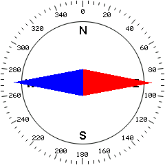
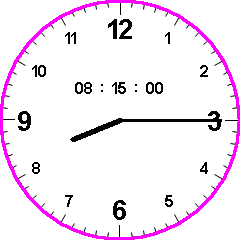

# BMPC - Simulate BMP as TFT LCD 

In microcontroller programming, if you've worked with LCDs, you know that the code you write is usually not what you see on an LCD. **BMPC** can simulate all LCDs, so you can see everything you program for LCDs without wasting time on repeated compile and program.

 &nbsp; &nbsp; &nbsp; &nbsp; 

**BMPC** Written in C by standard libraries.
This library simply saves frames in BMP-24 windows format with any dimensions. For more flexibility, the execution of files is entrusted to other software. 

It is recommended to use [ImageGlass](https://imageglass.org/) for open `.pmp` file.

##### Example:

```c
#include <stdio.h>
#include <stdlib.h>
#include <string.h>
#include <stdint.h>

#include "bmpc.h"

bmpc_screen_s Screen1;

int main(int argc, char** argv)
{
    bmpc_init(&Screen1,"Screen1",500,500);
    
    bmpc_fill_screen(&Screen1,bmpc_convert_color(0,0xff,0xff));
    bmpc_fill_rect(&Screen1,100,100,300,300,bmpc_convert_color(0x00,0x00,0xff));
    
    bmpc_update(&Screen1);
}
```
#### Higher layer 

You can use [Dispcolor](https://github.com/liyanboy74/dispcolor) for more functions. 

##### Example using Dispcolor:

```c
#include <stdio.h>
#include <stdlib.h>
#include <string.h>
#include <stdint.h>

#include "dispcolor.h"
#include "compas.h"

int main(int argc, char** argv)
{
    dispcolor_Init(240,240);

    while(1)
    {
        DrawCompas(1);
        dispcolor_Update();
        _sleep(150);
    }
}
```
